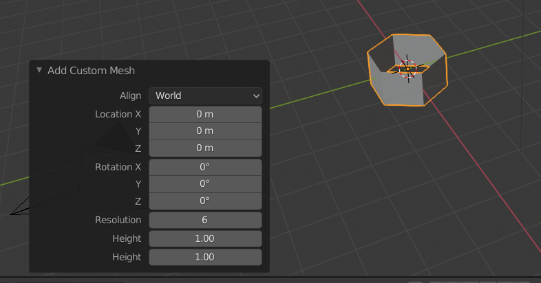
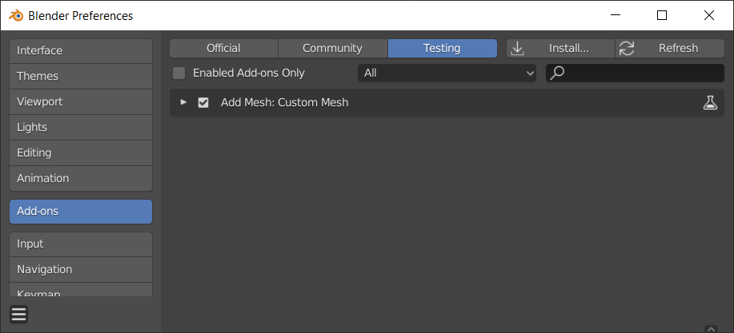
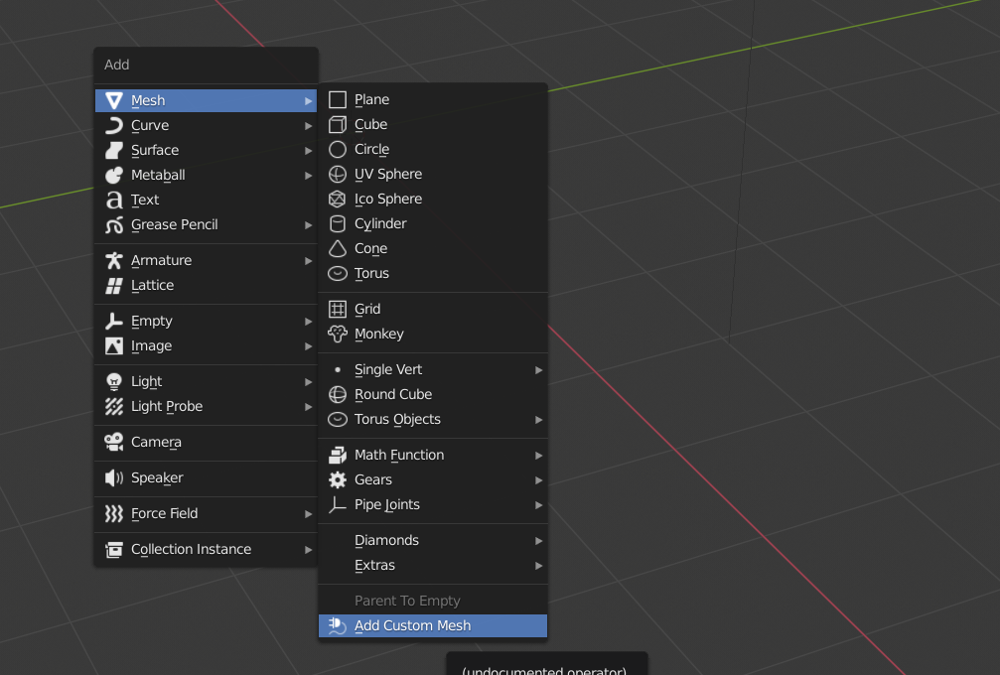

# bpy custom mesh example

This is blender addon example.
This addon provide functionality to add simple cylinder mesh.
You can change cylinder aspect and resolution from menu.

## Installation

Windows:

1. Copy this repository to `C:\Program Files\Blender Foundation\Blender 2.8x\2.8x\scripts\addons`
2. Start `blender.exe`
3. Open Blender Preferences
4. Find and Enable Addon on `Add-ons` Tab

## Usage

1. Press `Shift-A` on 3D Viewport
2. Choose `Add >> Mesh >> Add Custom Mesh` operator

